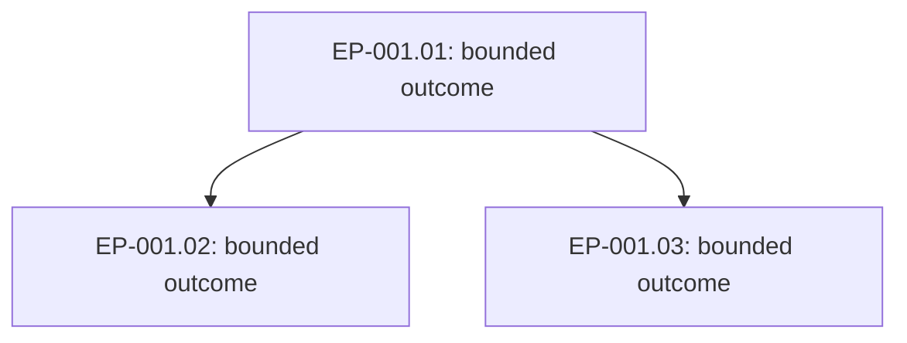

# Engineering Plan Proposal and Approved Plan Contract

## Purpose and status

This companion guidance defines the semantic artifacts produced by the
`product-architect` Role. It is a Markdown-first planning contract, not a
workflow schema, scheduler input, task runner, approval system, or mandatory
directory layout. A project chooses a navigable location using its own knowledge
topology and the OSK Blueprint's classification discipline.

An Engineering Plan (`EP-001`, `EP-002`, ...) represents one engineering
objective. It is not a sprint and is not restricted to a timebox. Its numbered
work nodes represent bounded engineering outcomes, not automatically executable
jobs.

## Engineering Plan Proposal

The proposal exists before a plan is fully materialized. It asks a human to
review the intended decomposition and resolve material ambiguity; it grants no
execution authority by itself.

```markdown
# EP-001 — <objective> — Proposal

## Status

PROPOSED — awaiting human review and approval

## Objective and boundary

<Desired product/engineering outcome and what this plan does not cover.>

## Grounding

<Requirements, decisions, designs, source, evidence, and current knowledge
read; identify their authority and relevant limits.>

## Product/system understanding

<Actors, use cases, domain concepts/entities, and flows where relevant. State
why an omitted category is not relevant rather than inventing it.>

## Assumptions and material uncertainty

<Facts vs assumptions; exact human clarification or authority needed.>

## Proposed strategy and topology

<Candidate outcomes, important boundaries, and where durable knowledge, plans,
work records, reviews, and evidence should remain navigable in this project.>

## Proposed work outline and dependencies

<Candidate numbered Role-assigned outcomes and dependency/parallelism rationale.
This may be less detailed than the approved plan but must expose material
sequencing choices.>

## Approval request

<Scope to approve, decisions requested, known limitations, and what will be
materialized only after approval.>
```

## Human clarification and approval

Questions are material when their answer could change the objective, behavior,
acceptance, priority, boundary, risk, dependencies, ownership, or required
evidence. Ask rather than silently choose.

An approved plan records enough information to identify the human authority,
date or durable decision reference, plan identifier/revision, approved scope,
and any qualification. Approval may be revised or withdrawn by the responsible
authority; a later revision preserves the earlier rationale rather than
rewriting it as if it never existed.

## Approved Engineering Plan

After approval, materialize a navigable plan. Keep it readable by a human who
must coordinate execution manually.

```markdown
# EP-001 — <objective>

## Status

APPROVED — <authority/date or decision reference>

## Objective, boundary, and approval

<Approved outcome, exclusions, approval reference, and qualifications.>

## Grounding and project topology

<Authoritative product/engineering context, important actors/use cases/domain
concepts/flows, assumptions, and locations of durable knowledge/evidence.>

## Dependency graph

<Mermaid graph when it materially improves comprehension.>

## Work nodes

### EP-001.01 — <title>

- **Assigned Role:** `<canonical-role-id>`
- **Intent and outcome:** <bounded outcome this Role owns>
- **Relevant context and requirements:** <only what this executor needs>
- **Constraints / established direction:** <approved constraints, patterns, or
  decisions; distinguish them from open questions>
- **Expected evidence:** <observable evidence expected for this outcome>
- **Dependencies:** <node IDs and why; `none` when independent>
- **Permitted parallelism:** <which nodes may proceed independently, if any>
- **Handoff / stop condition:** <what this node supplies and what it must not
  assume or execute>

### EP-001.02 — <title>

<Use the same fields for every node.>

## Material unresolved uncertainty and recommended decisions

<Preserve uncertainty not resolved by approval; identify authority/decision and
effect on the plan.>

## Plan evolution

<Links to superseding/revised plan, if any; do not silently erase approval or
rationale history.>
```

## Work-node and dependency semantics

Every node has a stable plan-local number such as `EP-001.01`, exactly one
assigned OSK Role, a bounded outcome, dependencies, relevant context,
constraints, expected evidence, and a handoff/stop condition. Assigning a Role
does not prescribe its Skills, Capabilities, providers, tools, implementation,
independent review outcome, or authority outside the node.

`A -> B` means B depends on the outcome or information produced by A. Two edges
from A to B and C may express that B and C can proceed independently after A;
they do not require concurrent execution. A diagram aids comprehension, but the
written node fields and dependency rationale remain authoritative when a diagram
is incomplete or visually ambiguous.

Use Mermaid when a graph materially improves comprehension of three or more
nodes, branching, converging dependencies, or a non-obvious critical path. For
example:



A simple sequential plan may be clearer as a numbered list. The graph is never
a runtime contract.

## Handoff and stop

At plan materialization, Product Architect supplies the approved plan and stops.
Downstream executors adopt their assigned Roles, choose their own operational
composition, and independently determine completion, block, failure, escalation,
and review worthiness. Human coordination may follow the plan manually; no
automatic continuation is implied.
