# myIR — Information Retrieval Engine

myIR is a **didactic information retrieval engine** written in Java that reconstructs the classical foundations of search engines from first principles. It has grown from a simple inverted-index toy into a broader experimentation platform covering lexical retrieval, sparse vector retrieval, concurrent web crawling, and IR system architecture.

The project intentionally builds everything from scratch — tokenization, normalization, inverted indexes, TF-IDF, BM25, cosine similarity over sparse vectors — to deeply understand how search engines work. It does not aim to compete with Lucene or Elasticsearch; it aims to **understand and rebuild core IR ideas from first principles**.

## Module Architecture

The project is organized into three Maven modules, each a named JPMS module:

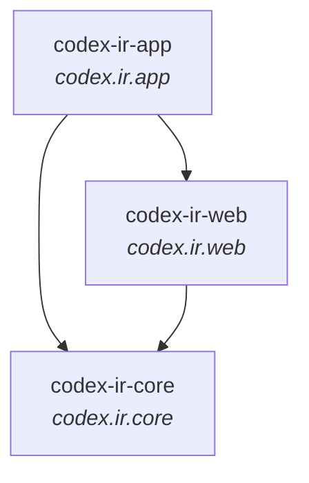
```mermaid
graph TD
    APP["codex-ir-app<br/><i>codex.ir.app</i>"]
    WEB["codex-ir-web<br/><i>codex.ir.web</i>"]
    CORE["codex-ir-core<br/><i>codex.ir.core</i>"]

    APP --> WEB
    APP --> CORE
    WEB --> CORE
```

| Module | JPMS Name | Role |
|--------|-----------|------|
| `codex-ir-core` | `codex.ir.core` | Core IR engine — tokenization, normalization, indexing, ranking, search, sparse vectors, vocabulary |
| `codex-ir-web` | `codex.ir.web` | Web crawling, URI canonicalization, page classification, product extraction, ingestion |
| `codex-ir-app` | `codex.ir.app` | Application entry point — demo runners, discovery workflows |

### Package Dependency Graph

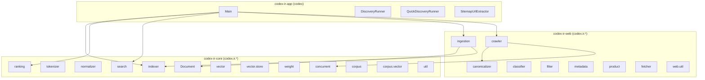
```mermaid
graph TD
    subgraph core["codex-ir-core (codex.ir.*)"]
        D[Document]
        T[tokenizer]
        N[normalizer]
        I[indexer]
        R[ranking]
        S[search]
        V[vector]
        VS[vector.store]
        W[weight]
        C[concurrent]
        CP[corpus]
        CV[corpus.vector]
        U[util]
    end

    subgraph web["codex-ir-web (codex.ir.*)"]
        CN[canonicalizer]
        IG[ingestion]
        CR[crawler]
        CL[classifier]
        FL[filter]
        MD[metadata]
        PD[product]
        FET[fetcher]
        WU[web.util]
    end

    subgraph app["codex-ir-app (codex)"]
        M[Main]
        DR[DiscoveryRunner]
        QDR[QuickDiscoveryRunner]
        SE[SitemapUrlExtractor]
    end

    IG --> D
    IG --> I
    CR --> CN
    CR --> C
    M --> I
    M --> R
    M --> S
    M --> IG
    M --> CR
```

## Core Package Diagrams

### `codex.ir` — Document Model

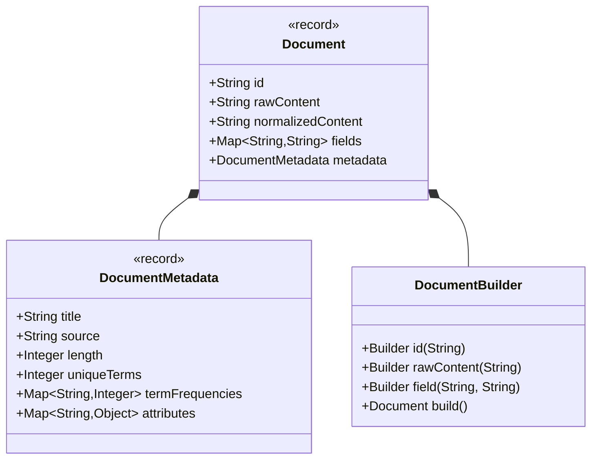
```mermaid
classDiagram
    class Document {
        <<record>>
        +String id
        +String rawContent
        +String normalizedContent
        +Map~String,String~ fields
        +DocumentMetadata metadata
    }
    class DocumentMetadata {
        <<record>>
        +String title
        +String source
        +Integer length
        +Integer uniqueTerms
        +Map~String,Integer~ termFrequencies
        +Map~String,Object~ attributes
    }
    class DocumentBuilder {
        +Builder id(String)
        +Builder rawContent(String)
        +Builder field(String, String)
        +Document build()
    }
    Document *-- DocumentMetadata
    Document *-- DocumentBuilder
```

### `codex.ir.tokenizer` — Tokenization

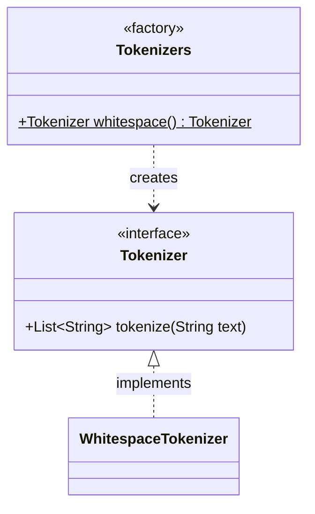
```mermaid
classDiagram
    class Tokenizer {
        <<interface>>
        +List~String~ tokenize(String text)
    }
    class Tokenizers {
        <<factory>>
        +Tokenizer whitespace()$ Tokenizer
    }
    Tokenizer <|.. WhitespaceTokenizer : implements
    Tokenizers ..> Tokenizer : creates
```

### `codex.ir.normalizer` — Normalization

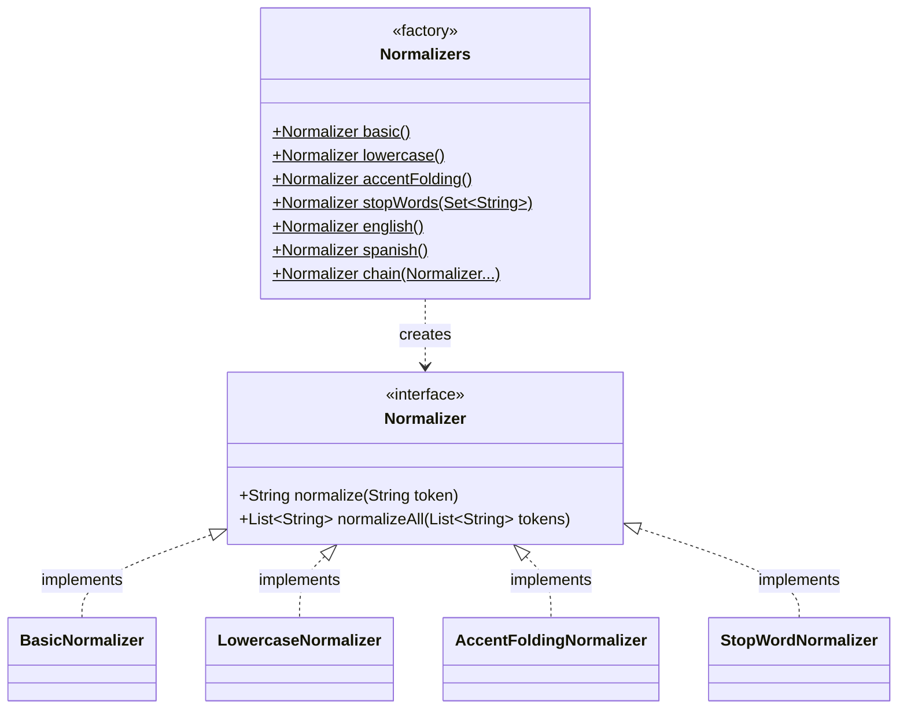
```mermaid
classDiagram
    class Normalizer {
        <<interface>>
        +String normalize(String token)
        +List~String~ normalizeAll(List~String~ tokens)
    }
    class Normalizers {
        <<factory>>
        +Normalizer basic()$
        +Normalizer lowercase()$
        +Normalizer accentFolding()$
        +Normalizer stopWords(Set~String~)$
        +Normalizer english()$
        +Normalizer spanish()$
        +Normalizer chain(Normalizer...)$
    }
    Normalizer <|.. BasicNormalizer : implements
    Normalizer <|.. LowercaseNormalizer : implements
    Normalizer <|.. AccentFoldingNormalizer : implements
    Normalizer <|.. StopWordNormalizer : implements
    Normalizers ..> Normalizer : creates
```

### `codex.ir.concurrent` — Concurrency Utilities

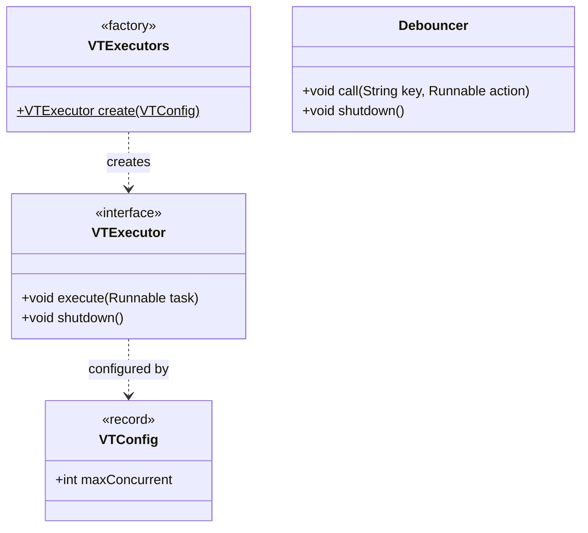
```mermaid
classDiagram
    class VTExecutor {
        <<interface>>
        +void execute(Runnable task)
        +void shutdown()
    }
    class VTConfig {
        <<record>>
        +int maxConcurrent
    }
    class VTExecutors {
        <<factory>>
        +VTExecutor create(VTConfig)$
    }
    class Debouncer {
        +void call(String key, Runnable action)
        +void shutdown()
    }
    VTExecutors ..> VTExecutor : creates
    VTExecutor ..> VTConfig : configured by
```

### `codex.ir.corpus` — Document Corpus

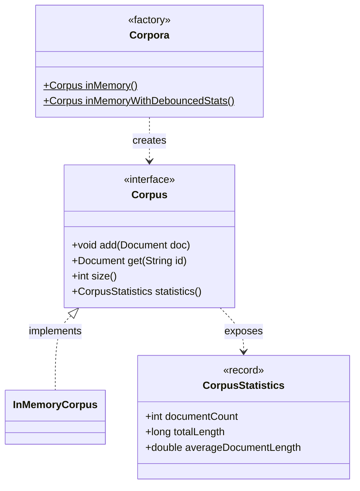
```mermaid
classDiagram
    class Corpus {
        <<interface>>
        +void add(Document doc)
        +Document get(String id)
        +int size()
        +CorpusStatistics statistics()
    }
    class Corpora {
        <<factory>>
        +Corpus inMemory()$
        +Corpus inMemoryWithDebouncedStats()$
    }
    class CorpusStatistics {
        <<record>>
        +int documentCount
        +long totalLength
        +double averageDocumentLength
    }
    Corpus <|.. InMemoryCorpus : implements
    Corpora ..> Corpus : creates
    Corpus ..> CorpusStatistics : exposes
```

### `codex.ir.corpus.vector` — Vocabulary

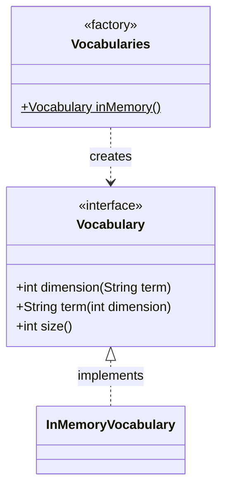
```mermaid
classDiagram
    class Vocabulary {
        <<interface>>
        +int dimension(String term)
        +String term(int dimension)
        +int size()
    }
    class Vocabularies {
        <<factory>>
        +Vocabulary inMemory()$
    }
    Vocabulary <|.. InMemoryVocabulary : implements
    Vocabularies ..> Vocabulary : creates
```

### `codex.ir.indexer` — Indexing Pipeline

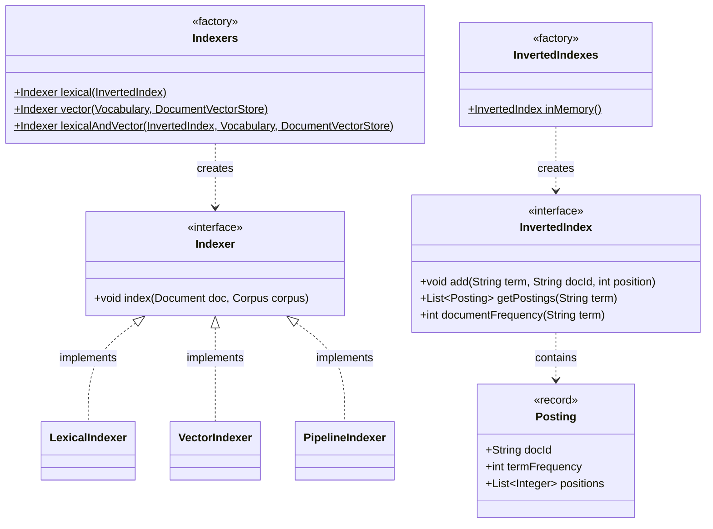
```mermaid
classDiagram
    class Indexer {
        <<interface>>
        +void index(Document doc, Corpus corpus)
    }
    class Indexers {
        <<factory>>
        +Indexer lexical(InvertedIndex)$
        +Indexer vector(Vocabulary, DocumentVectorStore)$
        +Indexer lexicalAndVector(InvertedIndex, Vocabulary, DocumentVectorStore)$
    }
    class InvertedIndex {
        <<interface>>
        +void add(String term, String docId, int position)
        +List~Posting~ getPostings(String term)
        +int documentFrequency(String term)
    }
    class InvertedIndexes {
        <<factory>>
        +InvertedIndex inMemory()$
    }
    class Posting {
        <<record>>
        +String docId
        +int termFrequency
        +List~Integer~ positions
    }
    Indexer <|.. LexicalIndexer : implements
    Indexer <|.. VectorIndexer : implements
    Indexer <|.. PipelineIndexer : implements
    Indexers ..> Indexer : creates
    InvertedIndex ..> Posting : contains
    InvertedIndexes ..> InvertedIndex : creates
```

### `codex.ir.ranking` — Ranking Strategies

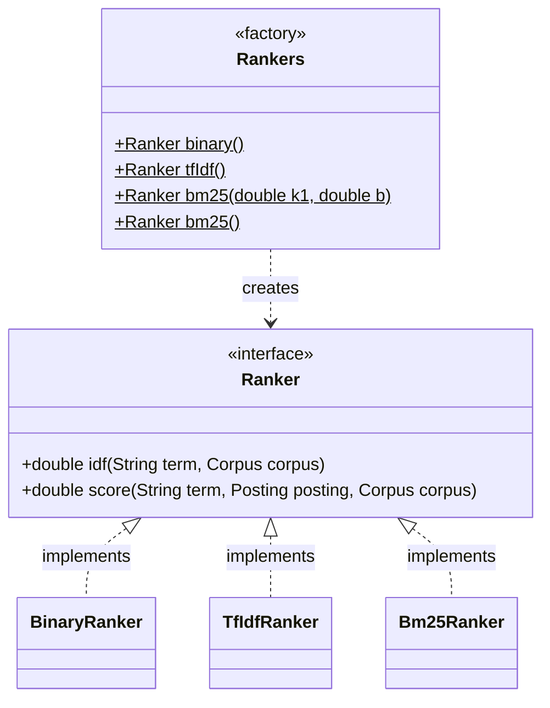
```mermaid
classDiagram
    class Ranker {
        <<interface>>
        +double idf(String term, Corpus corpus)
        +double score(String term, Posting posting, Corpus corpus)
    }
    class Rankers {
        <<factory>>
        +Ranker binary()$
        +Ranker tfIdf()$
        +Ranker bm25(double k1, double b)$
        +Ranker bm25()$
    }
    Ranker <|.. BinaryRanker : implements
    Ranker <|.. TfIdfRanker : implements
    Ranker <|.. Bm25Ranker : implements
    Rankers ..> Ranker : creates
```

### `codex.ir.search` — Search

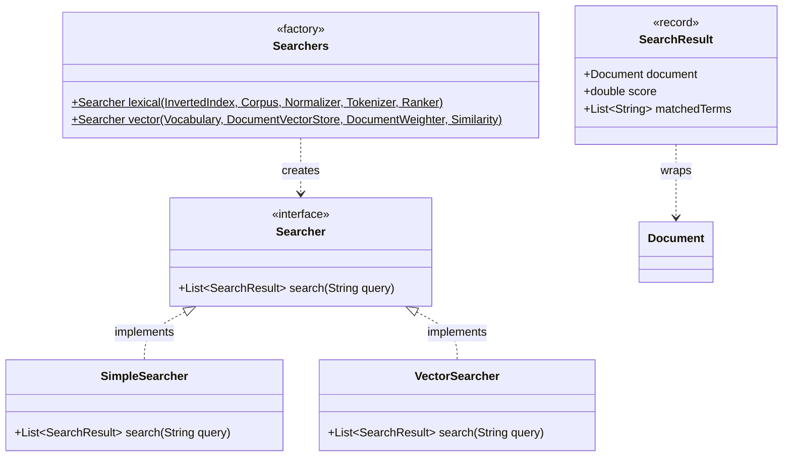
```mermaid
classDiagram
    class Searcher {
        <<interface>>
        +List~SearchResult~ search(String query)
    }
    class Searchers {
        <<factory>>
        +Searcher lexical(InvertedIndex, Corpus, Normalizer, Tokenizer, Ranker)$
        +Searcher vector(Vocabulary, DocumentVectorStore, DocumentWeighter, Similarity)$
    }
    class SearchResult {
        <<record>>
        +Document document
        +double score
        +List~String~ matchedTerms
    }
    class SimpleSearcher {
        +List~SearchResult~ search(String query)
    }
    class VectorSearcher {
        +List~SearchResult~ search(String query)
    }
    Searcher <|.. SimpleSearcher : implements
    Searcher <|.. VectorSearcher : implements
    Searchers ..> Searcher : creates
    SearchResult ..> Document : wraps
```

### `codex.ir.vector` — Sparse Vectors

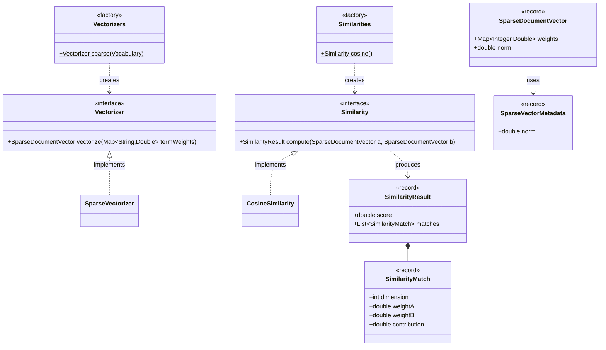
```mermaid
classDiagram
    class Vectorizer {
        <<interface>>
        +SparseDocumentVector vectorize(Map~String,Double~ termWeights)
    }
    class Vectorizers {
        <<factory>>
        +Vectorizer sparse(Vocabulary)$
    }
    class SparseDocumentVector {
        <<record>>
        +Map~Integer,Double~ weights
        +double norm
    }
    class Similarity {
        <<interface>>
        +SimilarityResult compute(SparseDocumentVector a, SparseDocumentVector b)
    }
    class Similarities {
        <<factory>>
        +Similarity cosine()$
    }
    class SimilarityResult {
        <<record>>
        +double score
        +List~SimilarityMatch~ matches
    }
    class SimilarityMatch {
        <<record>>
        +int dimension
        +double weightA
        +double weightB
        +double contribution
    }
    class SparseVectorMetadata {
        <<record>>
        +double norm
    }
    Vectorizer <|.. SparseVectorizer : implements
    Vectorizers ..> Vectorizer : creates
    Similarity <|.. CosineSimilarity : implements
    Similarities ..> Similarity : creates
    Similarity ..> SimilarityResult : produces
    SimilarityResult *-- SimilarityMatch
    SparseDocumentVector ..> SparseVectorMetadata : uses
```

### `codex.ir.vector.store` — Vector Persistence

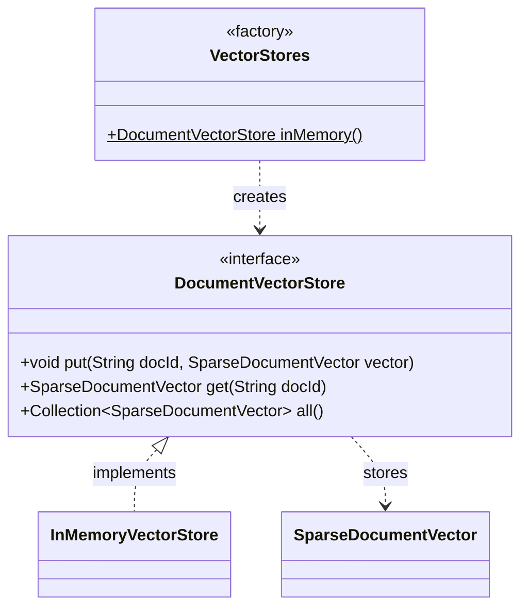
```mermaid
classDiagram
    class DocumentVectorStore {
        <<interface>>
        +void put(String docId, SparseDocumentVector vector)
        +SparseDocumentVector get(String docId)
        +Collection~SparseDocumentVector~ all()
    }
    class VectorStores {
        <<factory>>
        +DocumentVectorStore inMemory()$
    }
    DocumentVectorStore <|.. InMemoryVectorStore : implements
    VectorStores ..> DocumentVectorStore : creates
    DocumentVectorStore ..> SparseDocumentVector : stores
```

### `codex.ir.weight` — Term Weighting

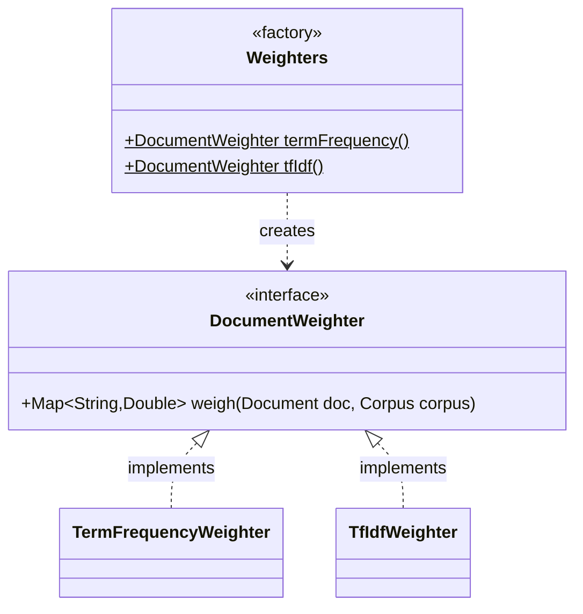
```mermaid
classDiagram
    class DocumentWeighter {
        <<interface>>
        +Map~String,Double~ weigh(Document doc, Corpus corpus)
    }
    class Weighters {
        <<factory>>
        +DocumentWeighter termFrequency()$
        +DocumentWeighter tfIdf()$
    }
    DocumentWeighter <|.. TermFrequencyWeighter : implements
    DocumentWeighter <|.. TfIdfWeighter : implements
    Weighters ..> DocumentWeighter : creates
```

## Web Package Diagrams

### `codex.ir.canonicalizer` — URI Canonicalization

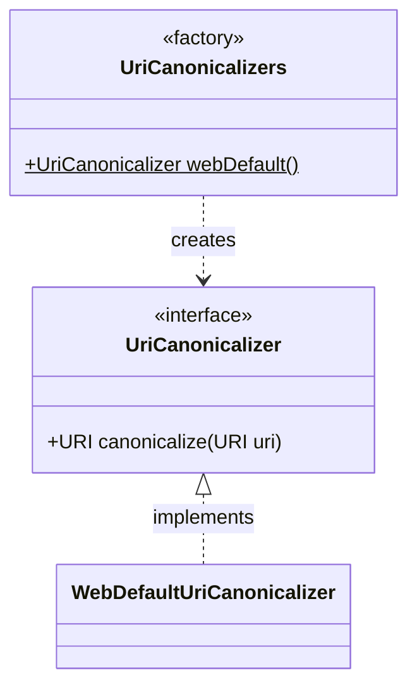
```mermaid
classDiagram
    class UriCanonicalizer {
        <<interface>>
        +URI canonicalize(URI uri)
    }
    class UriCanonicalizers {
        <<factory>>
        +UriCanonicalizer webDefault()$
    }
    UriCanonicalizer <|.. WebDefaultUriCanonicalizer : implements
    UriCanonicalizers ..> UriCanonicalizer : creates
```

### `codex.ir.ingestion` — Ingestion Pipeline

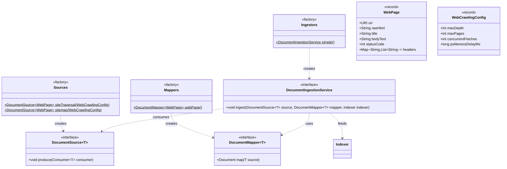
```mermaid
classDiagram
    class DocumentSource~T~ {
        <<interface>>
        +void produce(Consumer~T~ consumer)
    }
    class DocumentMapper~T~ {
        <<interface>>
        +Document map(T source)
    }
    class DocumentIngestionService {
        <<interface>>
        +void ingest(DocumentSource~?~ source, DocumentMapper~?~ mapper, Indexer indexer)
    }
    class Ingestors {
        <<factory>>
        +DocumentIngestionService simple()$
    }
    class Mappers {
        <<factory>>
        +DocumentMapper~WebPage~ webPage()$
    }
    class Sources {
        <<factory>>
        +DocumentSource~WebPage~ siteTraversal(WebCrawlingConfig)$
        +DocumentSource~WebPage~ sitemap(WebCrawlingConfig)$
    }
    class WebPage {
        <<record>>
        +URI uri
        +String rawHtml
        +String title
        +String bodyText
        +int statusCode
        +Map~String,List~String~~ headers
    }
    class WebCrawlingConfig {
        <<record>>
        +int maxDepth
        +int maxPages
        +int concurrentFetches
        +long politenessDelayMs
    }
    DocumentIngestionService ..> DocumentSource : consumes
    DocumentIngestionService ..> DocumentMapper : uses
    DocumentIngestionService ..> Indexer : feeds
    Ingestors ..> DocumentIngestionService : creates
    Mappers ..> DocumentMapper : creates
    Sources ..> DocumentSource : creates
```

### `codex.ir.ingestion.crawler` — Web Crawler

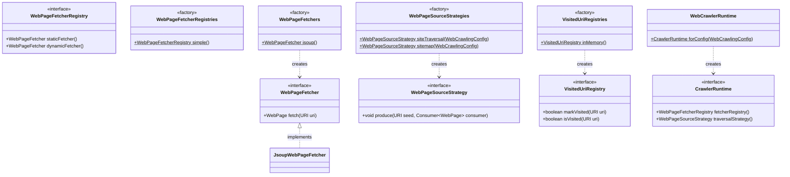
```mermaid
classDiagram
    class WebPageFetcher {
        <<interface>>
        +WebPage fetch(URI uri)
    }
    class WebPageFetcherRegistry {
        <<interface>>
        +WebPageFetcher staticFetcher()
        +WebPageFetcher dynamicFetcher()
    }
    class WebPageFetcherRegistries {
        <<factory>>
        +WebPageFetcherRegistry simple()$
    }
    class WebPageFetchers {
        <<factory>>
        +WebPageFetcher jsoup()$
    }
    class WebPageSourceStrategy {
        <<interface>>
        +void produce(URI seed, Consumer~WebPage~ consumer)
    }
    class WebPageSourceStrategies {
        <<factory>>
        +WebPageSourceStrategy siteTraversal(WebCrawlingConfig)$
        +WebPageSourceStrategy sitemap(WebCrawlingConfig)$
    }
    class VisitedUriRegistry {
        <<interface>>
        +boolean markVisited(URI uri)
        +boolean isVisited(URI uri)
    }
    class VisitedUriRegistries {
        <<factory>>
        +VisitedUriRegistry inMemory()$
    }
    class CrawlerRuntime {
        <<interface>>
        +WebPageFetcherRegistry fetcherRegistry()
        +WebPageSourceStrategy traversalStrategy()
    }
    class WebCrawlerRuntime {
        +CrawlerRuntime forConfig(WebCrawlingConfig)$
    }
    WebPageFetcher <|.. JsoupWebPageFetcher : implements
    WebPageFetchers ..> WebPageFetcher : creates
    WebPageSourceStrategies ..> WebPageSourceStrategy : creates
    VisitedUriRegistries ..> VisitedUriRegistry : creates
    WebCrawlerRuntime ..> CrawlerRuntime : creates
```

### `codex.ir.ingestion.crawler.classifier` — Page Classification

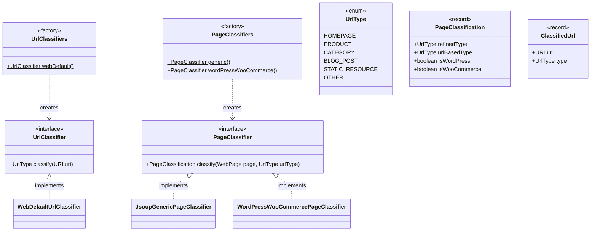
```mermaid
classDiagram
    class UrlClassifier {
        <<interface>>
        +UrlType classify(URI uri)
    }
    class UrlClassifiers {
        <<factory>>
        +UrlClassifier webDefault()$
    }
    class PageClassifier {
        <<interface>>
        +PageClassification classify(WebPage page, UrlType urlType)
    }
    class PageClassifiers {
        <<factory>>
        +PageClassifier generic()$
        +PageClassifier wordPressWooCommerce()$
    }
    class UrlType {
        <<enum>>
        HOMEPAGE
        PRODUCT
        CATEGORY
        BLOG_POST
        STATIC_RESOURCE
        OTHER
    }
    class PageClassification {
        <<record>>
        +UrlType refinedType
        +UrlType urlBasedType
        +boolean isWordPress
        +boolean isWooCommerce
    }
    class ClassifiedUrl {
        <<record>>
        +URI uri
        +UrlType type
    }
    UrlClassifier <|.. WebDefaultUrlClassifier : implements
    UrlClassifiers ..> UrlClassifier : creates
    PageClassifier <|.. JsoupGenericPageClassifier : implements
    PageClassifier <|.. WordPressWooCommercePageClassifier : implements
    PageClassifiers ..> PageClassifier : creates
```

### `codex.ir.ingestion.crawler.filter` — URL Filtering

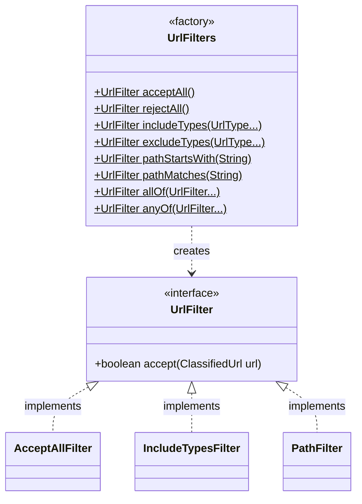
```mermaid
classDiagram
    class UrlFilter {
        <<interface>>
        +boolean accept(ClassifiedUrl url)
    }
    class UrlFilters {
        <<factory>>
        +UrlFilter acceptAll()$
        +UrlFilter rejectAll()$
        +UrlFilter includeTypes(UrlType...)$
        +UrlFilter excludeTypes(UrlType...)$
        +UrlFilter pathStartsWith(String)$
        +UrlFilter pathMatches(String)$
        +UrlFilter allOf(UrlFilter...)$
        +UrlFilter anyOf(UrlFilter...)$
    }
    UrlFilter <|.. AcceptAllFilter : implements
    UrlFilter <|.. IncludeTypesFilter : implements
    UrlFilter <|.. PathFilter : implements
    UrlFilters ..> UrlFilter : creates
```

### `codex.ir.ingestion.crawler.metadata` — Page Metadata

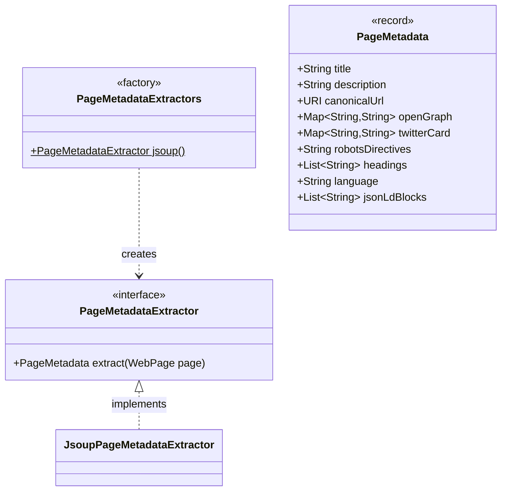
```mermaid
classDiagram
    class PageMetadataExtractor {
        <<interface>>
        +PageMetadata extract(WebPage page)
    }
    class PageMetadataExtractors {
        <<factory>>
        +PageMetadataExtractor jsoup()$
    }
    class PageMetadata {
        <<record>>
        +String title
        +String description
        +URI canonicalUrl
        +Map~String,String~ openGraph
        +Map~String,String~ twitterCard
        +String robotsDirectives
        +List~String~ headings
        +String language
        +List~String~ jsonLdBlocks
    }
    PageMetadataExtractor <|.. JsoupPageMetadataExtractor : implements
    PageMetadataExtractors ..> PageMetadataExtractor : creates
```

### `codex.ir.ingestion.crawler.product` — Product Extraction

```mermaid
classDiagram
    class ProductDiscoverer {
        <<interface>>
        +ProductDiscoveryResult discover(WebPage page)
    }
    class ProductDiscoverers {
        <<factory>>
        +ProductDiscoverer jsoupBased()$
    }
    class ProductCardExtractor {
        <<interface>>
        +List~ProductCard~ extractCards(WebPage page)
    }
    class ProductCardExtractors {
        <<factory>>
        +ProductCardExtractor jsoupGeneric()$
    }
    class ProductDetailExtractor {
        <<interface>>
        +Optional~ProductDetail~ extractDetail(WebPage page)
    }
    class ProductDetailExtractors {
        <<factory>>
        +ProductDetailExtractor jsoupGeneric()$
    }
    class ProductCard {
        <<record>>
        +URI url
        +String name
        +Optional~ProductPrice~ price
        +Optional~URI~ imageUrl
    }
    class ProductDetail {
        <<record>>
        +String name
        +String sku
        +String description
        +List~ProductPrice~ prices
        +List~ProductImage~ images
        +String brand
        +String availability
    }
    class ProductDiscoveryResult {
        <<record>>
        +URI pageUri
        +PageClassification classification
        +Optional~ProductDetail~ productDetail
        +List~ProductCard~ productCards
    }
    class ProductPrice {
        <<record>>
        +BigDecimal amount
        +String currency
    }
    class ProductImage {
        <<record>>
        +URI url
        +String altText
        +int order
    }
    ProductDiscoverer ..> ProductCardExtractor : uses
    ProductDiscoverer ..> ProductDetailExtractor : uses
    ProductDiscoverer ..> PageClassifier : uses
    ProductDiscoverer ..> ProductDiscoveryResult : produces
    ProductDiscoveryResult *-- ProductCard
    ProductDiscoveryResult *-- ProductDetail
    ProductDetail *-- ProductPrice
    ProductDetail *-- ProductImage
```

## App Package

### `codex` — Application Entry Points

```mermaid
classDiagram
    class Main {
        +void main(String[])$
    }
    class DiscoveryRunner {
        +void run(String[] args)
    }
    class QuickDiscoveryRunner {
        +void main(String[])$
    }
    class SitemapUrlExtractor {
        +List~URI~ extractFromSitemap(URI sitemapUrl)
    }
    class OutputMode {
        <<enum>>
        CONSOLE
        JSON
        BOTH
    }
    QuickDiscoveryRunner ..> DiscoveryRunner : delegates
    DiscoveryRunner ..> SitemapUrlExtractor : uses
    DiscoveryRunner ..> OutputMode : configures
```

## Data Flow

### Indexing Pipeline

```
Raw Document / WebPage
        │
        ▼
DocumentPreprocessor
  - resolve content (fields or rawContent)
  - tokenize
  - normalize (lowercase, stop-word removal, stemming)
  - derive metadata (length, unique terms, term frequencies)
        │
        ▼
    PipelineIndexer
     ├── LexicalIndexer → InvertedIndex
     └── VectorIndexer  → Vocabulary + DocumentVectorStore
```

### Lexical Search

```
Query
  │
  ▼
Tokenizer + Normalizer
  │
  ▼
InvertedIndex → Posting lists
  │
  ▼
Ranker (Binary / TF-IDF / BM25)
  │
  ▼
SearchResult list (sorted by descending score)
```

### Vector Search

```
Query
  │
  ▼
Tokenizer + Normalizer
  │
  ▼
DocumentWeighter → term weights
  │
  ▼
Vectorizer → sparse query vector
  │
  ▼
Similarity (cosine) × DocumentVectorStore
  │
  ▼
SimilarityResult list (sorted by descending similarity)
```

### Web Crawling

```
Seed URLs
  │
  ▼
UriCanonicalizer (fragment removal, lowercasing, path normalization)
  │
  ▼
WebPageSourceStrategy
  ├── SiteTraversalStrategy (BFS with depth control, politeness)
  └── SitemapSiteTraversalStrategy (robots.txt → sitemap → URLs)
  │
  ▼
WebPageFetcher (Jsoup static / Playwright dynamic)
  │
  ▼
WebPage → PageClassifier → ProductDiscoverer
  │
  ▼
DocumentMapper → Document → Indexer
```

## How to Run

### Prerequisites

- **Java 25** — Maven is pinned to `source=25` `target=25`. No other JDK version will work.
- **Maven** (any recent version) — the project uses standard Maven; no wrapper is checked in.
- **Playwright** (for crawler tests only) — run `npx playwright install` once before any test that exercises `WebPageFetcher`.

### Build and Test

```shell
# Full build
mvn compile

# All tests
mvn test

# Single test in a specific module (avoids scanning all modules)
mvn test -pl codex-ir-core -Dtest=codex.ir.ranking.RankersTest

# Full verification
mvn compile && mvn test-compile && mvn test
```

### Running the Application

The main entry point is `codex.Main` in `codex-ir-app`:

```shell
mvn exec:java -pl codex-ir-app -Dexec.mainClass="codex.Main"
```

This runs a demo that exercises in-memory indexing and optionally web crawling with lexical or vector search.

### Quick Discovery Runner

For product discovery experiments:

```shell
mvn exec:java -pl codex-ir-app -Dexec.mainClass="codex.QuickDiscoveryRunner"
```

### Site Exporter

`SiteExporterCommand` crawls a website, mirrors it to disk, and exports the result as a PDF or Markdown document. It is useful for converting documentation sites, online books, and other multi-page resources into a single readable artifact.

#### Full pipeline — crawl and export

```shell
mvn exec:java -pl codex-ir-app \
  -Dexec.mainClass="codex.apps.siteexporter.SiteExporterCommand" \
  -Dexec.args="--url https://example.com/"
```

This crawls `https://example.com/`, saves mirrored HTML to `./mirror/`, and writes `./output.pdf`.

#### Skip the crawl — resume from an existing mirror

If the site has already been mirrored, pass `--from-mirror` to skip crawling entirely and go straight to export. No network requests are made.

```shell
mvn exec:java -pl codex-ir-app \
  -Dexec.mainClass="codex.apps.siteexporter.SiteExporterCommand" \
  -Dexec.args="--from-mirror ./mirror --output ./site.pdf"
```

#### Export as Markdown

Use `--format markdown` to extract readable text instead of rendering a PDF. This is useful for NotebookLM ingestion, text review, or further processing. Asset download and link rewriting are skipped automatically.

```shell
mvn exec:java -pl codex-ir-app \
  -Dexec.mainClass="codex.apps.siteexporter.SiteExporterCommand" \
  -Dexec.args="--url https://example.com/ --format markdown --output ./site.md"
```

Combine with `--from-mirror` for the fastest path — no crawl, no asset download, just text extraction:

```shell
mvn exec:java -pl codex-ir-app \
  -Dexec.mainClass="codex.apps.siteexporter.SiteExporterCommand" \
  -Dexec.args="--from-mirror ./mirror --format markdown --output ./site.md"
```

#### Full parameter reference

| Flag | Default | Description |
|------|---------|-------------|
| `--url <url>` | *(required unless `--from-mirror`)* | Seed URL to crawl |
| `--from-mirror <dir>` | — | Skip crawl; read manifest from this directory |
| `--out-dir <dir>` | `./mirror` (or `<from-mirror>` dir) | Directory where mirrored HTML files live or are saved |
| `--max-pages <n>` | `100` | Maximum pages to crawl |
| `--max-depth <n>` | `3` | Maximum crawl depth from the seed URL |
| `--no-same-domain` | *(flag, off by default)* | Follow links to other domains |
| `--format pdf\|markdown` | `pdf` | Output format |
| `--output <path>` | `./output.pdf` or `./output.md` | Path for the final artifact |

#### Output artifacts

| Format | Primary output | Side output |
|--------|---------------|-------------|
| PDF | `<output>.pdf` | `<out-dir>/reader-pages/*.reader.html` — clean HTML for pdf2htmlEX pages |
| Markdown | `<output>.md` | `<out-dir>/markdown-pages/*.html.md` — one `.md` file per mirrored page |

Pages generated by [pdf2htmlEX](https://github.com/pdf2htmlEX/pdf2htmlEX) are automatically detected and routed through a text-extraction pipeline before rendering, producing readable output regardless of the original PDF layout.

## Design Decisions

The project is guided by a **build-it-from-scratch** philosophy. Key architectural decisions are captured as ADRs in `docs/`:

| ADR | Topic |
|-----|-------|
| ADR-001 | Corpus statistics publication strategy |
| ADR-002 | Indexing assembly inside `Indexers` |
| ADR-003 | In-memory storage (no persistence yet) |
| ADR-004 | Document fields aggregated into whole-document content |
| ADR-005 | Future field-aware indexing (proposed, not implemented) |

Also see [`docs/CODING_IDENTITY.md`](docs/CODING_IDENTITY.md) for the project's design philosophy and [`docs/Future-Forward.md`](docs/Future-Forward.md) for postponed capabilities.

### Architectural Principles

- **Interface + Factory pattern** — every domain concept follows `Xxx` interface + `Xxxes` static factory. Implementations are hidden as inner classes.
- **Domain types as records** — all data types are Java records, not bare maps or generic containers.
- **In-memory by design** — corpus, inverted index, vector store, and vocabulary all live in memory. No persistence without explicit request.
- **JPMS module boundaries** — each Maven module is a named JPMS module with explicit exports. Internal packages (`internal/`, `fetcher/`, `util/`) are not exported.
- **Virtual threads** — concurrency uses virtual threads and structured concurrency where applicable.

## Module READMEs

- [codex-ir-core](codex-ir-core/README.md) — detailed core module documentation
- [codex-ir-web](codex-ir-web/README.md) — web crawling and ingestion documentation
- [codex-ir-app](codex-ir-app/README.md) — application entry points

## Project Status

- **Lexical indexing** — implemented
- **TF-IDF / BM25 ranking** — implemented
- **Web crawling & ingestion** — implemented
- **Sparse vector indexing** — implemented
- **Vector search** — implemented (experimental)
- **Site Exporter (PDF)** — implemented; crawl → mirror → PDF with pdf2htmlEX detection
- **Site Exporter (Markdown)** — implemented; crawl or resume → text extraction → `.md`
- **Hybrid search** — planned
- **Disk-backed persistence** — deferred (see ADR-003)
- **Field-aware search** — planned (see ADR-005)
- **ePub export** — planned
