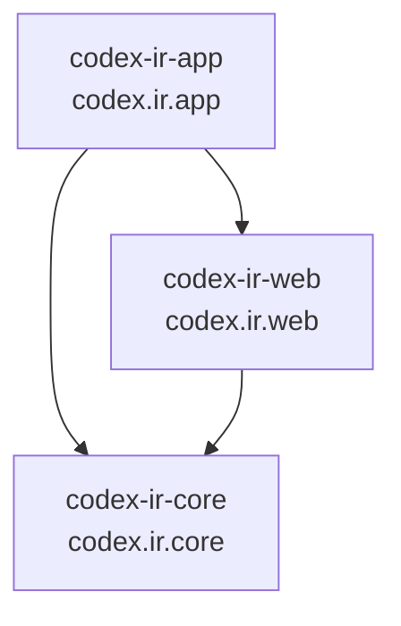
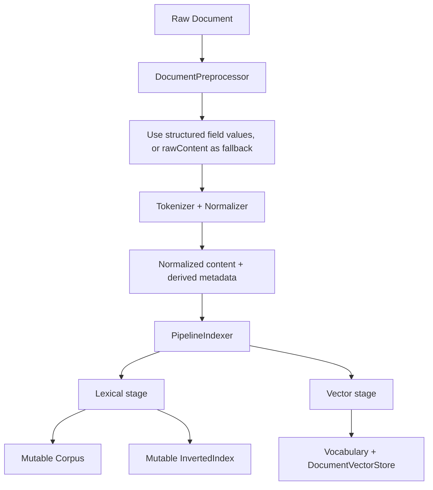
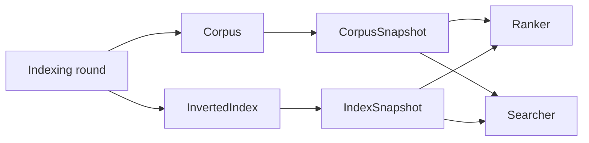
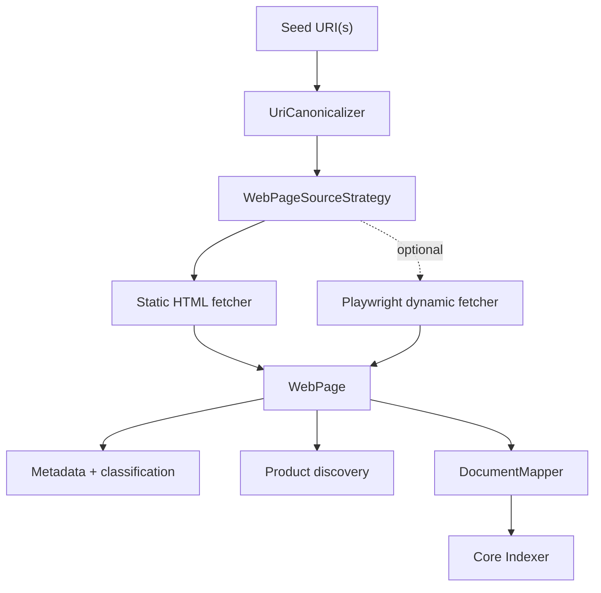
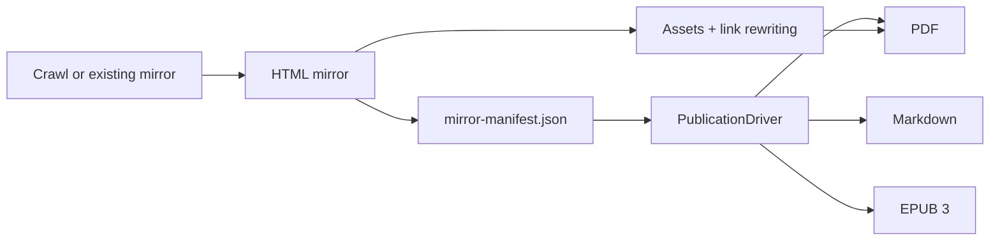

# myIR — Information Retrieval Laboratory

myIR is a Java 25 laboratory for rebuilding information-retrieval and web-ingestion systems from first principles. It combines a classical lexical engine, sparse-vector retrieval, concurrent crawling, product extraction, and a site-to-publication exporter.

The project is intentionally educational, but its boundaries are designed to support serious experiments. It does not attempt to replace Lucene or Elasticsearch.

## Current Capabilities

- Tokenization and composable normalization for English and Spanish.
- In-memory corpus and positional inverted index.
- Immutable corpus and index snapshots for consistent search reads.
- Binary, TF-IDF, and BM25 ranking.
- Sparse vectors, vocabulary-backed dimensions, TF/TF-IDF weighting, and cosine similarity.
- Static HTML crawling with JDK `HttpClient` and Jsoup.
- Optional Playwright-backed dynamic page fetching.
- Queue-based breadth-first traversal using virtual threads.
- URI canonicalization, URL filtering, metadata extraction, and sitemap parsing.
- Page classification and product discovery for generic and WordPress/WooCommerce pages.
- Site mirroring with portable JSON manifests.
- Asset download and local link rewriting for PDF publication.
- PDF, Markdown, and EPUB publication from a new or existing mirror.

## Module Architecture

The project is a three-module Maven reactor. Every module is also a named JPMS module.



| Maven module | JPMS module | Responsibility |
|---|---|---|
| `codex-ir-core` | `codex.ir.core` | Domain-neutral IR engine: documents, indexing, snapshots, ranking, search, and sparse vectors |
| `codex-ir-web` | `codex.ir.web` | Reusable ingestion and web primitives: crawling, canonicalization, classification, metadata, and product extraction |
| `codex-ir-app` | `codex.ir.app` | Executable demos, discovery workflows, and the site-exporter application |

Dependency direction is `app -> web -> core`. Application-specific publication code stays in `codex-ir-app`; web concepts do not leak into `codex-ir-core`.

The `module-info.java` files are authoritative for JPMS visibility. In particular, fetcher implementations, crawler internals, and web utilities are not exported from `codex.ir.web`.

## Core Engine

### Document Processing and Indexing



`Document` is the central record. It preserves raw and normalized text, structured fields, and derived `DocumentMetadata`. When fields contain usable values, preprocessing aggregates those values instead of `rawContent`; blank fields fall back to raw content.

Main factory pairs include:

| Contract | Factory | Implemented strategies |
|---|---|---|
| `Corpus` | `Corpora` | Eager or debounced in-memory statistics |
| `InvertedIndex` | `InvertedIndexes` | Positional in-memory postings |
| `Indexer` | `Indexers` | Lexical, vector, or combined pipeline |
| `Tokenizer` | `Tokenizers` | Whitespace tokenization |
| `Normalizer` | `Normalizers` | Lowercase, accent folding, punctuation trimming, stop words, chains |
| `Ranker` | `Rankers` | Binary, TF-IDF, BM25 |
| `Searcher` | `Searchers` | Lexical and sparse-vector search |
| `Vocabulary` | `Vocabularies` | Shared in-memory term dimensions |
| `Vectorizer` | `Vectorizers` | Sparse document vectors |
| `Similarity` | `Similarities` | Sparse cosine similarity |
| `DocumentVectorStore` | `VectorStores` | In-memory vector storage |
| `DocumentWeighter` | `Weighters` | Term frequency and TF-IDF |

### Snapshot Read Boundary

Ingestion writes to mutable `Corpus` and `InvertedIndex` instances. Search and ranking consume immutable point-in-time views:



This makes publication of a search-visible state explicit and prevents readers from observing a partially updated index.

### Retrieval Paths

Lexical retrieval tokenizes and normalizes a query, resolves postings from an `IndexSnapshot`, scores matching documents with binary, TF-IDF, or BM25 ranking, and returns descending `SearchResult` values.

Vector retrieval weighs normalized query terms, creates a sparse query vector using the shared vocabulary, compares it with vectors in `DocumentVectorStore`, and returns matches above the configured similarity threshold.

All core storage remains in memory by design.

## Web Ingestion

`codex-ir-web` exposes reusable crawling and extraction contracts while keeping implementations under internal, non-exported packages.



The default traversal is queue-based breadth-first crawling with configurable depth, page count, domain policy, request delay, concurrency, content types, timeouts, and path/domain restrictions. Sitemap and robots parsing are implemented as reusable crawler internals. The site-exporter command currently starts from normal site traversal; it does not automatically switch to sitemap discovery.

Static fetching is the default path. `WebPageFetchers.dynamicHtml()` provides Playwright rendering, but applications must select that fetcher explicitly.

## Site Exporter

The site exporter lives under `codex.apps.siteexporter` because it is an application workflow, not reusable IR or crawler infrastructure.



### Mirror Contract

`SiteMirrorService` writes one local HTML file per successful page and records every processed page in `mirror-manifest.json`. The manifest is read and written with Jackson through `ManifestReader` and `ManifestWriter`.

Important manifest guarantees:

- `localHtmlPath` is relative to the manifest directory and uses portable `/` separators.
- Successful entries resolve to local HTML files.
- Failed writes remain visible as failed entries.
- Counts are derived from the page list when the manifest is built or read.
- `depth` remains `null` when the traversal source does not expose depth.
- `discoveredOrder` provides deterministic publication order for a given source emission order.

### Publication Formats

| Format | Driver | Asset processing | Current behavior |
|---|---|---|---|
| PDF | `PdfPublicationDriver` | Yes | Downloads assets, rewrites local links, renders pages with OpenHTMLToPDF, and merges them with PDFBox |
| Markdown | `MarkdownPublicationDriver` | No | Extracts readable text into one `.md` document and optional per-page Markdown files |
| EPUB | `EpubPublicationDriver` | No | Produces an EPUB 3 archive with navigation and ordered XHTML chapters using `java.util.zip` |

The PDF path detects pdf2htmlEX output and routes it through a reader-oriented extraction step before rendering. Markdown and EPUB share `ReadablePageExtractor` for normal HTML and pdf2htmlEX pages.

Current EPUB limitations: chapters are text-only, custom styling is minimal, heading hierarchy is flattened, and generated files have not yet been validated with `epubcheck`.

## Build and Test

### Prerequisites

- Java 25.
- Maven.
- Playwright browser binaries only for tests or experiments that use dynamic fetching:

```shell
npx playwright install
```

### Commands

```shell
# Compile the complete reactor
mvn compile

# Run every test
mvn test

# Run one core test without scanning unrelated modules
mvn test -pl codex-ir-core -Dtest=codex.ir.ranking.RankersTest

# Build an application module together with reactor dependencies
mvn test -pl codex-ir-app -am

# Full verification
mvn compile && mvn test-compile && mvn test
```

When `codex-ir-core` or `codex-ir-web` has uninstalled local changes, include `-am` while working on `codex-ir-app`; otherwise Maven may resolve an older installed dependency.

## Running Applications

### IR and Crawling Demo

The primary demo entry point is `codex.scraper.Main`. Its current configuration performs live crawling, so inspect the configured seed URL before running it.

```shell
mvn exec:java -pl codex-ir-app \
  -Dexec.mainClass="codex.scraper.Main"
```

### Product Discovery

`DiscoveryRunner` accepts explicit product/category URLs or sitemap URLs:

```shell
mvn exec:java -pl codex-ir-app \
  -Dexec.mainClass="codex.scraper.DiscoveryRunner" \
  -Dexec.args="--sitemap https://example.com/product-sitemap.xml --limit 50 --output both --out-dir ./reports"
```

`codex.scraper.QuickDiscoveryRunner` is an IDE-oriented wrapper with arguments embedded in source.

### Site Exporter

Mirror a site and publish it as PDF:

```shell
mvn exec:java -pl codex-ir-app \
  -Dexec.mainClass="codex.apps.siteexporter.SiteExporterCommand" \
  -Dexec.args="--url https://example.com --out-dir ./mirror --format pdf --output ./site.pdf"
```

Resume from an existing mirror without network crawling:

```shell
mvn exec:java -pl codex-ir-app \
  -Dexec.mainClass="codex.apps.siteexporter.SiteExporterCommand" \
  -Dexec.args="--from-mirror ./mirror --format markdown --output ./site.md"
```

Create an EPUB from an existing mirror:

```shell
mvn exec:java -pl codex-ir-app \
  -Dexec.mainClass="codex.apps.siteexporter.SiteExporterCommand" \
  -Dexec.args="--from-mirror ./mirror --format epub --output ./site.epub"
```

| Flag | Default | Description |
|---|---|---|
| `--url <url>` | Required unless resuming | Seed URL for a new mirror |
| `--from-mirror <dir>` | None | Load an existing `mirror-manifest.json` and skip crawling |
| `--out-dir <dir>` | `./mirror`, or the resumed mirror directory | Mirror HTML and manifest directory |
| `--max-pages <n>` | `100` | Maximum pages for a new crawl |
| `--max-depth <n>` | `3` | Maximum traversal depth |
| `--no-same-domain` | Disabled | Permit links outside the seed domain |
| `--format pdf|markdown|epub` | `pdf` | Publication format |
| `--output <path>` | `./output.pdf`, `.md`, or `.epub` | Final artifact path, selected by format |

Typical side outputs inside the mirror directory include:

- `mirror-manifest.json` — mirrored page metadata.
- `asset-manifest.json` — downloaded asset metadata for PDF runs.
- `reader-pages/` — reader-oriented HTML generated for pdf2htmlEX inputs.
- `markdown-pages/` — per-page Markdown generated by the Markdown driver.

## Design Rules

- Interface contracts are paired with static factories such as `Corpus`/`Corpora` and `ProductDiscoverer`/`ProductDiscoverers`.
- Domain data is represented by records; builders are used when construction is incremental.
- Mutable ingestion structures are separated from immutable search snapshots.
- Core remains domain-neutral, web owns reusable crawling primitives, and concrete applications stay in app.
- Persistence is intentionally deferred; current corpus, index, vocabulary, and vector stores are in memory.
- Virtual threads are used for concurrent blocking work where they simplify ownership and limits.
- Architectural decisions belong in ADRs under [`docs/adrs`](docs/adrs/).

See [`docs/CODING_IDENTITY.md`](docs/CODING_IDENTITY.md) for the project’s design philosophy and [`docs/Future-Forward.md`](docs/Future-Forward.md) for postponed work.

## Current Limitations and Next Directions

- Hybrid lexical/vector ranking is not implemented.
- Field values are aggregated before indexing; true field-specific postings and BM25F remain future work.
- Core storage is memory-only.
- The site-exporter command does not yet expose sitemap-first or dynamic-rendering crawl modes.
- Markdown and EPUB prioritize readable text over complete visual fidelity.
- EPUB output still needs real-reader and `epubcheck` validation.

## Module Documentation

- [`codex-ir-core/README.md`](codex-ir-core/README.md)
- [`codex-ir-web/README.md`](codex-ir-web/README.md)
- [`codex-ir-app/README.md`](codex-ir-app/README.md)
- [`docs/apps/site-exporter/ENGINEERING_LOG.md`](docs/apps/site-exporter/ENGINEERING_LOG.md)
